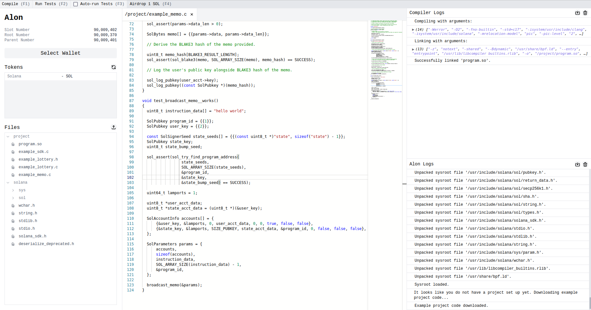

# alon

Alon is an IDE which allows for developers to rapidly build, iterate, test, and deploy decentralized apps and assets on Solana right from their browser.

By writing a very thin compiler and linker frontend on top of a WebAssembly port of Solana’s compiler suite, and by writing a barebones JavaScript port of Solana’s program virtual machine syscalls, Alon is able to cut down the time it takes to compile, run, and test Solana programs down to a few hundred milliseconds.

The code editor for Alon comes with Treesitter integrated, which allows for Alon to incrementally build and update an entire syntax tree of your Solana programs in under a millisecond.

Integrating Treesitter into Alon's code editor allows for the development of all new kinds of static analysis tools that may help significantly simplify and speed up the development of reliable Solana programs.

## project

### Seeing is believing

A live demo of Alon may be test run here: [beta.medadnewman.co.uk/alon/](http://beta.medadnewman.co.uk/alon/)




### Modules

- Frontend: https://github.com/lithdew/alon
- Sysroot: https://github.com/lithdew/alon-sysroot
- Scripts: https://github.com/mattnite/solana-bpf
- Tools: https://github.com/mattnite/alon-gen

### Built With

- React
- Tailwind
- Treesitter
- Emscripten
- Monaco Editor
- LLVM w/ Solana BPF

## getting started

Start a development server on port 3000:

```console
$ yarn start
```

Build a release version of Alon:

```console
$ yarn build
```

Deploy Alon on Github Pages:

```console
$ yarn deploy
```

## roadmap

- Better code/file navigation
- Keyboard navigation/shortcuts
- Treesitter-based code completion
- Port the clangd language server to WebAssembly
- Support other languages such as Zig, Rust, and Solang
- Completion of the UI for all of the static analysis tooling
- Port all remaining subcommands of the Solana CLI to Alon's UI
- Standalone executable to integrate Alon into your favorite editors
- Deploy/upgrade programs on the UI using the Upgradeable BPF Loader Program
- Port all remaining Solana program syscalls to Alon's WebAssembly-based test runner

## license

**alon**, and all of its source code is released under the [Apache License](LICENSE).